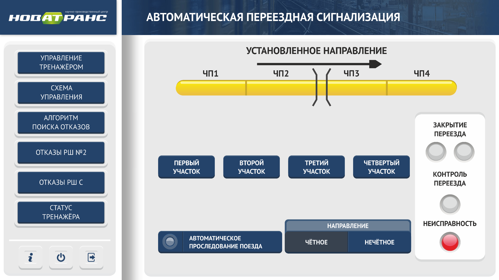
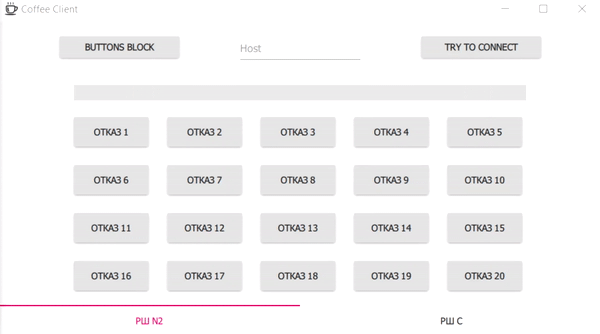
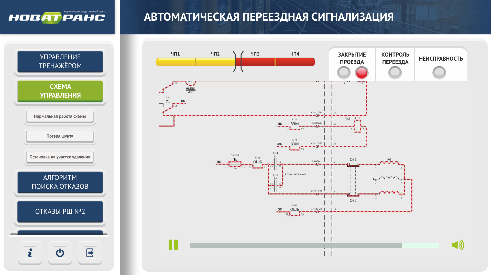
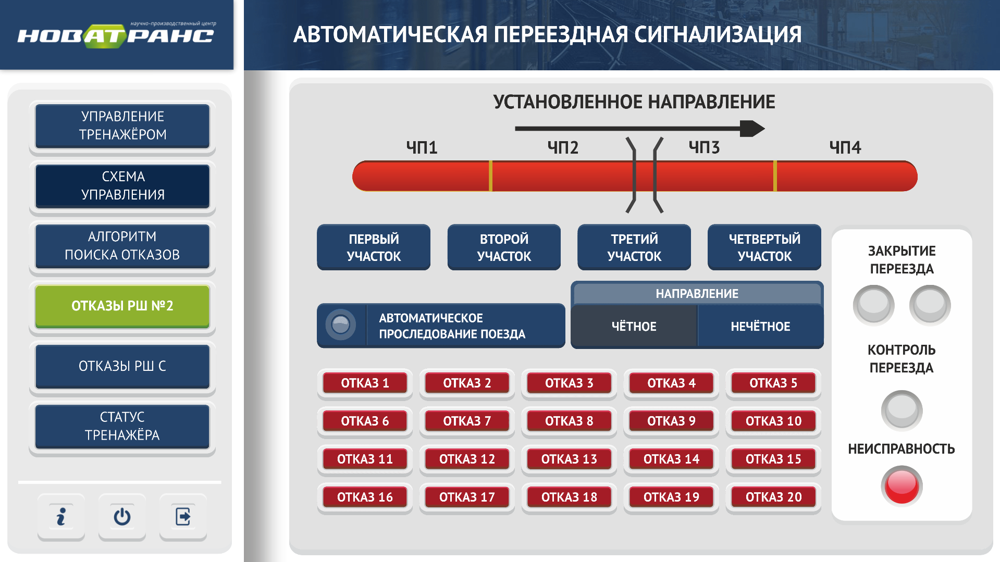
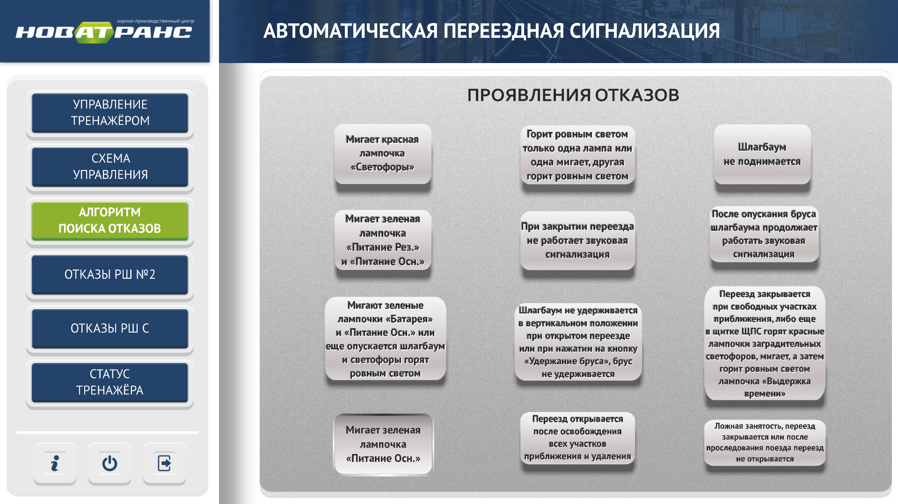
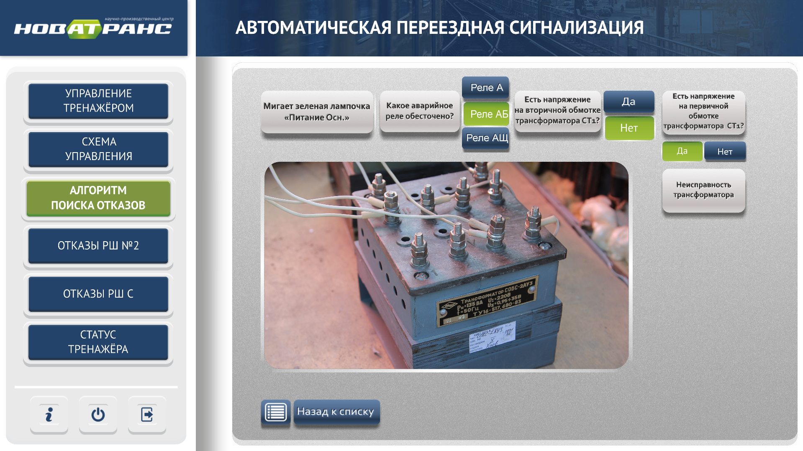
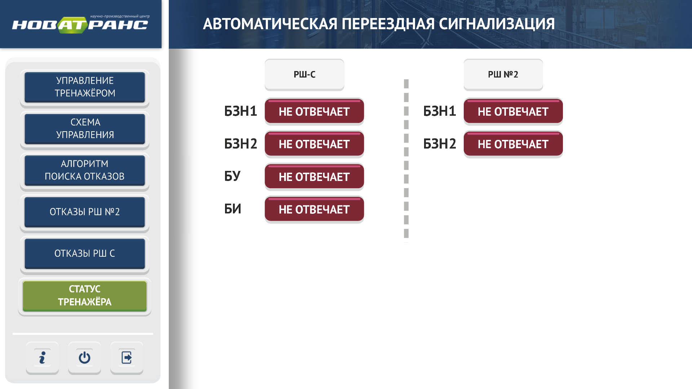

# AutoCrossSignaling



---

## Что это?

Программа предназначена:

* Для обучения принципам действия автоматической переездной сигнализации
* Для управления тренажером с помощью "Комплекта дистанционного задания неисправностей"

### Основные возможности

* Навигация по интерфейсу программы
* Управление тренажером, подключенным к последательному порту (serial port)
* Воспроизведение видео материалов в графическом интерфейсе
* Управление состоянием светофоров отображаемых в графическом интерфейсе
* Интерактивный алгоритм поиска неисправностей
* Отображение статуса подключенного тренажера
* Возможность работать в качестве TCP сервера для удаленного управления тренажером

#### Стек используемых технологий

* Qt Creator
* QML (для GUI)
* C/C++ (драйвер для тренажера и работа в качестве TCP сервера)

#### Репозиторий проекта

```	
https://github.com/a-khakimov/AutoCrossSignaling.git
```

## Coffee Client

Дополнительная тестовая утилита для совместной работы с AutoCrossSignaling. Используется для удаленного управления отказами.



### Как с этим работать?

* Запустить AutoCrossSignaling - он работает в качестве TCP сервера
* Запустить CoffeeClient - работает в качестве TCP клиента
* Задать IP-адрес сервера
* Включать/выключать отказы

### Логирование

Для вывода логов используется *PLOG*.

```
https://github.com/SergiusTheBest/plog.git
```

#### Сриншоты

##### Вкладка с видео



---

##### Вкладка для установки оказов



---

##### Вкладка для выбора алгорима поиска неисправностей



---

##### Интерактивный алгоритм поиска неисправностей



---

##### Вкладка для отображения состояния тренажера



---
__[Главная](https://a-khakimov.github.io/)__
---
