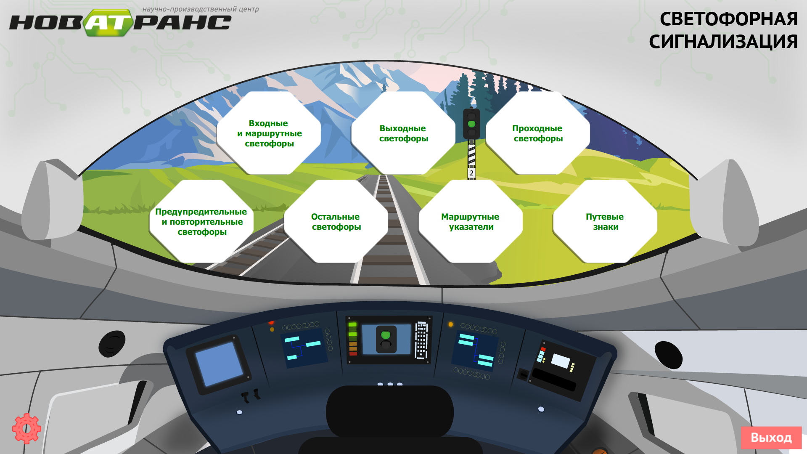
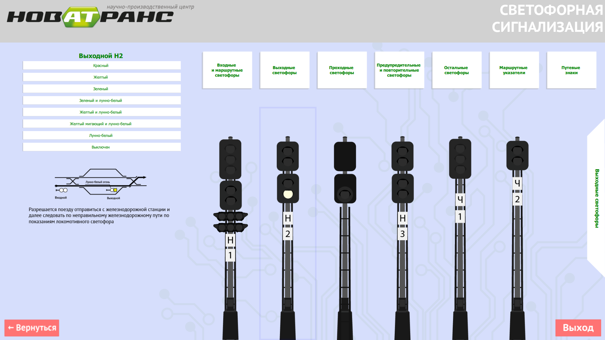
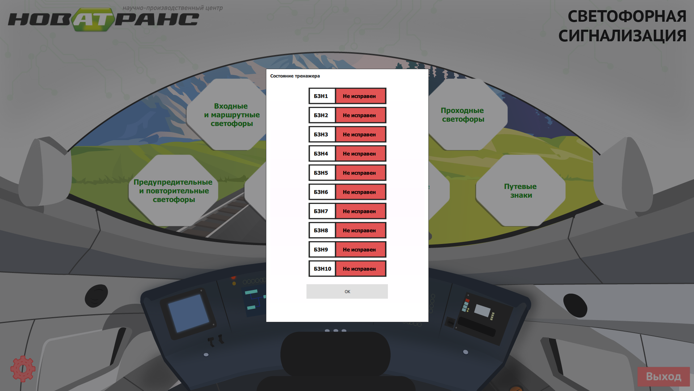

# RailwayTrafficLights

---

## Что это вообще?

Программа предназначена:

* Для обучения работе с устройствами сигнализации
* Для управления светофорной сигнализацией на тренажерном комплексе

### Основные возможности

* Навигация по интерфейсу программы
* Управление тренажером, подключенным к последательному порту (serial port)
* Управление состоянием светофоров отображаемых в графическом интерфейсе
* Отображение статуса подключенного тренажера

#### Стек используемых технологий

* Qt Creator
* QML (для GUI)
* C/C++ (разработка драйвера для тренажера)

#### Репозиторий проекта

[https://github.com/techlinked/RailwayTrafficLights.git](https://github.com/a-khakimov/RailwayTrafficLights.git)

#### Еще пара скриншотов

---

---
__[Главная](https://a-khakimov.github.io/)__
---
