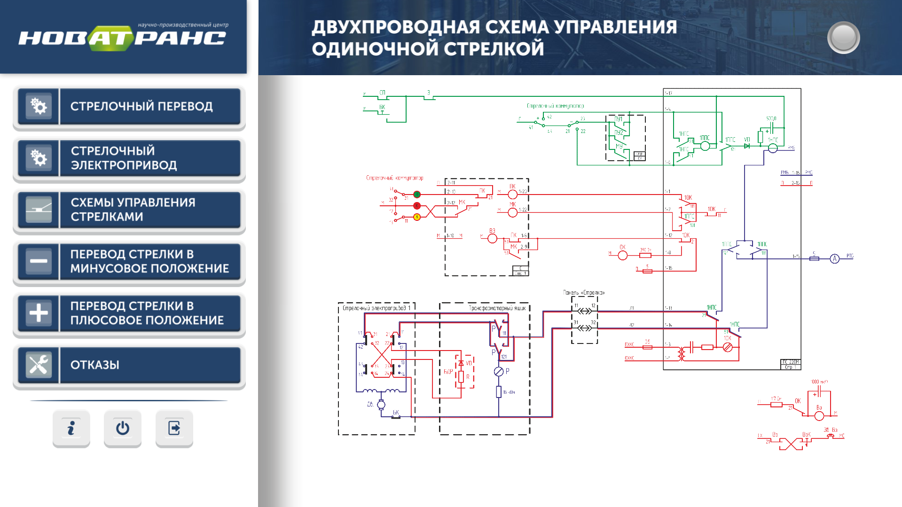
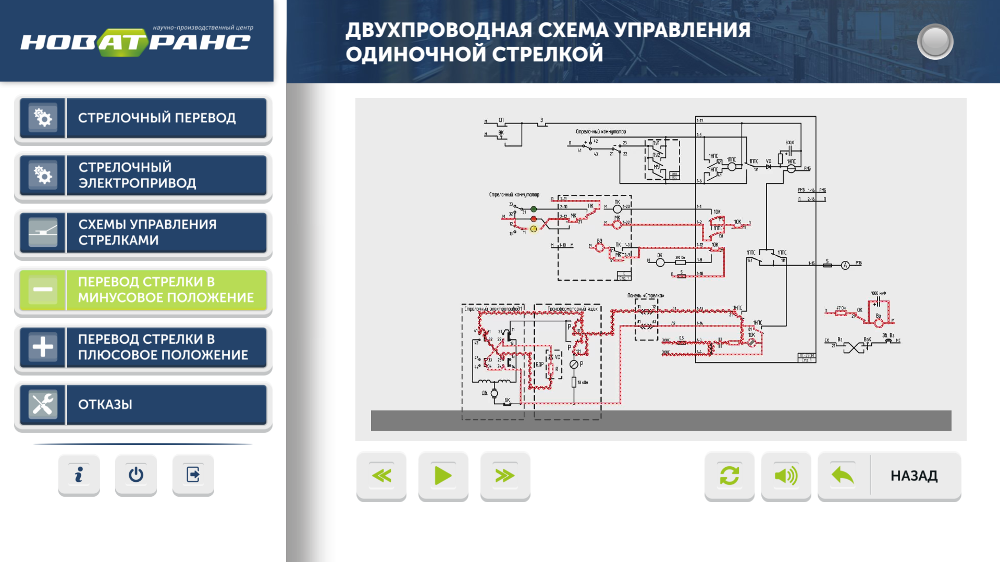
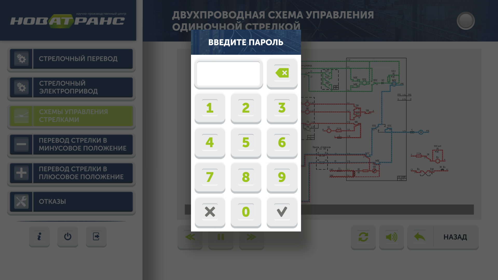

# ARMTrain

---

## Что это?

Программа предназначена обучения принципам действия стрелочных электроприводов, работе схем управления стрелками и управлению тренажером с помощью "Комплекса дистанционного задания неисправностей".

#### Основные возможности

* Навигация по интерфейсу программы
* Управление тренажером, подключенным к последательному порту (serial port)
* Воспроизведение видео и аудио материалов в графическом интерфейсе
* Выход из программы и выключение компьютера только по вводу пароля
* Отображение состояния подключенных устройств

#### Стек используемых технологий

* Qt Creator
* QML (для GUI)
* C/C++ (разработка драйвера для тренажера)

#### Репозиторий проекта

[https://github.com/techlinked/armtrain.git](https://github.com/techlinked/armtrain.git)

#### Еще пара скриншотов

---

---

__[Главная](https://a-khakimov.github.io/)__

---

